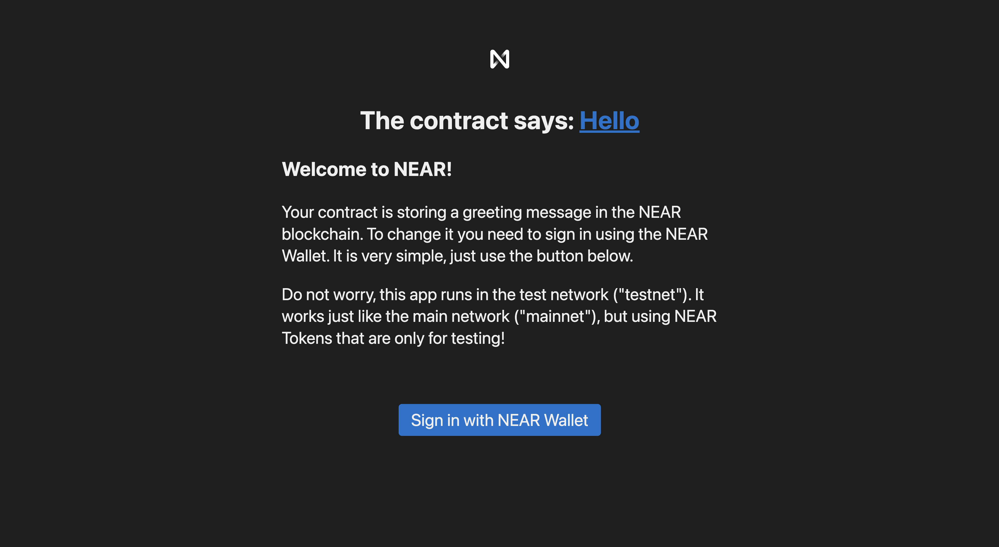
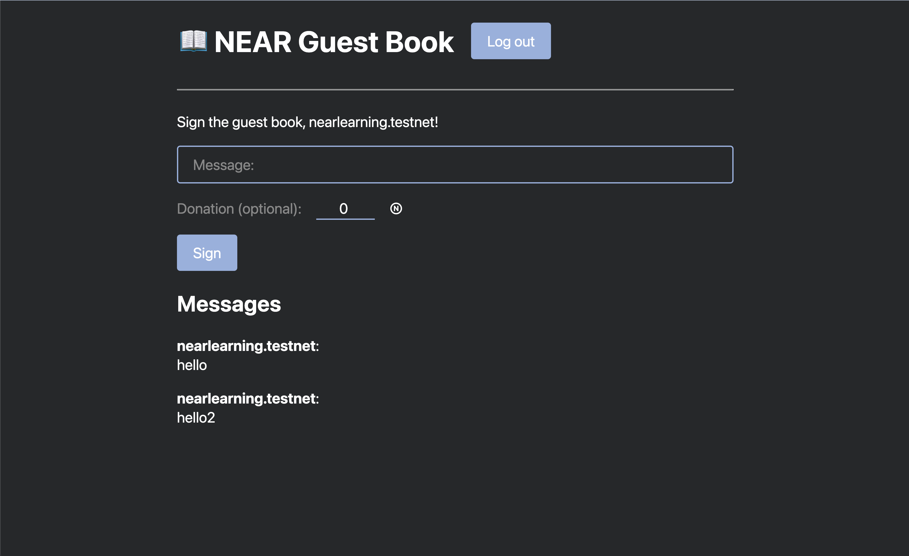
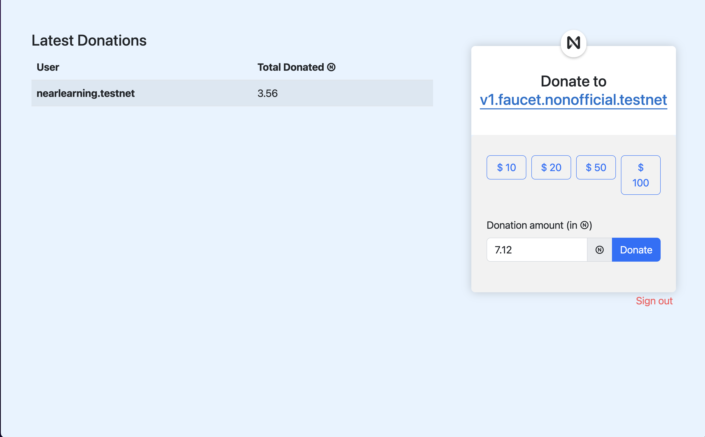
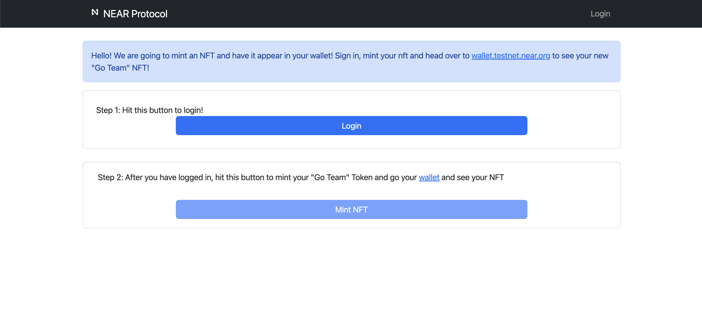

# NearLearning

Near Protocol を学習するためのリポジトリです。

### ウォレットの生成コマンド

`near generate-key my-new-account`  
 上記コマンドを打つとローカルの`~/.near-credentials/testnet/my-new-account.json`というファイルが生成されてそこに鍵ペアの情報が記載される。

### ネットワークの種類などは下記を参照すること

[https://docs.near.org/concepts/basics/networks](https://docs.near.org/concepts/basics/networks)

### テンプレの Near DApp プロジェクト生成コマンド

`npx create-near-app@latest my-dapp --contract rust --frontend react --tests rust`

うまく行けば`my-dapp`というディレクトリが生成され、下記のような内容が出力される。

```zsh
Creating a new NEAR dApp

======================================================
✅  Success! Created 'my-dapp'
   with a smart contract in Rust and a frontend template in React.js.
🦀 If you are new to Rust please visit https://www.rust-lang.org

  Your next steps:
   - Navigate to your project:
         cd my-dapp
   - Install all dependencies
         npm install
   - Build your contract:
         npm run build
   - Test your contract in NEAR SandBox:
         npm test
   - Deploy your contract to NEAR TestNet with a temporary dev account:
         npm run deploy
   - Start your frontend:
         npm start

🧠 Read README.md to explore further.
```

### ビルド方法

`cd my-dapp && npm i && npm run build`

```zsh
>> Building contract
info: component 'rust-std' for target 'wasm32-unknown-unknown' is up to date
   Compiling proc-macro2 v1.0.47
   Compiling quote v1.0.21
   Compiling unicode-ident v1.0.5
   Compiling syn v1.0.102
   Compiling serde v1.0.145
   Compiling version_check v0.9.4
   Compiling serde_derive v1.0.145
   Compiling once_cell v1.15.0
   Compiling crunchy v0.2.2
   Compiling wee_alloc v0.4.5
   Compiling serde_json v1.0.86
   Compiling cfg-if v0.1.10
   Compiling Inflector v0.11.4
   Compiling ryu v1.0.11
   Compiling memory_units v0.4.0
   Compiling itoa v1.0.4
   Compiling byteorder v1.4.3
   Compiling near-sys v0.2.0
   Compiling base64 v0.13.0
   Compiling bs58 v0.4.0
   Compiling static_assertions v1.1.0
   Compiling hex v0.4.3
   Compiling ahash v0.7.6
   Compiling uint v0.9.4
   Compiling hashbrown v0.11.2
   Compiling toml v0.5.9
   Compiling borsh-derive-internal v0.9.3
   Compiling borsh-schema-derive-internal v0.9.3
   Compiling proc-macro-crate v0.1.5
   Compiling borsh-derive v0.9.3
   Compiling near-sdk-macros v4.0.0
   Compiling borsh v0.9.3
   Compiling near-sdk v4.0.0
   Compiling hello_near v1.0.0 (/Users/harukikondo/git/NearLearning/my-dapp/contract)
    Finished release [optimized] target(s) in 43.27s
```

`contract/target/wasm32-unknown-unknown/release`フォルダ配下にビルドの成果物が出力される。  
今回の場合は、`hello_near.wasm`

### スマートコントラクトのデプロイ方法

`npm run deploy` or 上記コマンドでビルド済みであれば下記コマンドでデプロイ可能

```zsh
cd contract && near dev-deploy --wasmFile ./target/wasm32-unknown-unknown/release/hello_near.wasm
```

うまく行けば下記のように出力される。

```zsh
Starting deployment. Account id: dev-1666101496152-75593018686129, node: https://rpc.testnet.near.org, helper: https://helper.testnet.near.org, file: ./target/wasm32-unknown-unknown/release/hello_near.wasm
Transaction Id 64HxQ1dqTrZkLUpBVH4eVqcvYBMbWcvDZUULHNyoQJ76
To see the transaction in the transaction explorer, please open this url in your browser
https://explorer.testnet.near.org/transactions/64HxQ1dqTrZkLUpBVH4eVqcvYBMbWcvDZUULHNyoQJ76
Done deploying to dev-1666101496152-75593018686129
```

デプロイが完了したら`npm run start`でフロントを起動させる。



#### 開発用のウォレットのシードリカバリーフレーズ ※開発用！！※

```zsh
nearlearning.testnet

expect erupt antenna simple census stereo student sadness fever cousin news escape
```

### Counter Project のテスト結果

```zsh
running 5 tests
test tests::panics_on_overflow - should panic ... ok
test tests::panics_on_underflow - should panic ... ok
test tests::decrement ... ok
test tests::increment ... ok
test tests::increment_and_reset ... ok

test result: ok. 5 passed; 0 failed; 0 ignored; 0 measured; 0 filtered out; finished in 0.00s


> counter-rust@1.0.0 test:integration
> cd integration-tests && npm test -- -- "./contract/target/wasm32-unknown-unknown/release/contract.wasm"


> integration-tests@1.0.0 test
> ava "--" "./contract/target/wasm32-unknown-unknown/release/contract.wasm"


Contract logs from contract.test.near.increment({}) call: [ 'Increased number to 1' ]
  ✔ can be incremented (2.5s)
Contract logs from contract.test.near.increment({}) call: [ 'Increased number to 1' ]
Contract logs from contract.test.near.increment({}) call: [ 'Increased number to 1' ]
Contract logs from contract.test.near.decrement({}) call: [ 'Decreased number to 0' ]
  ✔ can be decremented (5s)
Contract logs from contract.test.near.increment({}) call: [ 'Increased number to 2' ]
Contract logs from contract.test.near.reset({}) call: [ 'Reset counter to zero' ]
  ✔ can be reset (7.5s)
  ─

  3 tests passed
```

### Counter Contract のデプロイ記録

```zsh
>> Building contract
info: component 'rust-std' for target 'wasm32-unknown-unknown' is up to date
    Finished release [optimized] target(s) in 1.78s
>> Deploying contract
Starting deployment. Account id: dev-1666224453427-38248329492791, node: https://rpc.testnet.near.org, helper: https://helper.testnet.near.org, file: ./target/wasm32-unknown-unknown/release/contract.wasm
Transaction Id 7nP16Qqgh6bExwUFa6Swh8GJzbjMcCWX12Bmzxco36bP
To see the transaction in the transaction explorer, please open this url in your browser
https://explorer.testnet.near.org/transactions/7nP16Qqgh6bExwUFa6Swh8GJzbjMcCWX12Bmzxco36bP
Done deploying to dev-1666224453427-38248329492791
```

### Guest Book のテスト結果

```zsh
running 2 tests
test tests::add_message ... ok
test tests::iters_messages ... ok

test result: ok. 2 passed; 0 failed; 0 ignored; 0 measured; 0 filtered out; finished in 0.00s


> guest-book-rust@1.0.0 test:integration
> cd integration-tests && npm test -- -- "./contract/target/wasm32-unknown-unknown/release/contract.wasm"


> integration-tests@1.0.0 test
> ava "--" "./contract/target/wasm32-unknown-unknown/release/contract.wasm"


  ✔ send one message and retrieve it (2.5s)
  ✔ send two messages and expect two total (5s)
  ─

  2 tests passed
```

### Guest Book Contract のデプロイ記録

```zsh
>> Deploying contract
Starting deployment. Account id: dev-1666229594742-78931601450570, node: https://rpc.testnet.near.org, helper: https://helper.testnet.near.org, file: ./target/wasm32-unknown-unknown/release/contract.wasm
Transaction Id DQvNJcKJyM9or2xnwje9oogpR8kNFggNVs8Q6QBALwxH
To see the transaction in the transaction explorer, please open this url in your browser
https://explorer.testnet.near.org/transactions/DQvNJcKJyM9or2xnwje9oogpR8kNFggNVs8Q6QBALwxH
Done deploying to dev-1666229594742-78931601450570
```

### Guest Book の起動例



### Donation の起動例

```zsh
   Finished test [unoptimized + debuginfo] target(s) in 32.08s
     Running unittests src/lib.rs (target/debug/deps/contract-523f2161a4e81e09)

running 2 tests
test tests::initializes ... ok
test tests::donate ... ok

test result: ok. 2 passed; 0 failed; 0 ignored; 0 measured; 0 filtered out; finished in 0.00s


> donation-rust@1.0.0 test:integration
> cd integration-tests && npm test -- -- "./contract/target/wasm32-unknown-unknown/release/contract.wasm"


> integration-tests@1.0.0 test
> ava "--" "./contract/target/wasm32-unknown-unknown/release/contract.wasm"


Contract logs from contract.test.near.donate({}) call: [
  'Thank you bob.test.near for donating 2000000000000000000000000! You donated a total of 2000000000000000000000000'
]
  ✔ records the donation (3s)
Contract logs from contract.test.near.donate({}) call: [
  'Thank you alice.test.near for donating 1000000000000000000000000! You donated a total of 1000000000000000000000000'
]
  ✔ sends donations to the beneficiary (3s)
  ─

  2 tests passed
```

### donation DApp の起動例



### cross contract のテスト結果

```zsh
running 1 test
test tests::initializes ... ok

test result: ok. 1 passed; 0 failed; 0 ignored; 0 measured; 0 filtered out; finished in 0.00s


> xcc-rust@1.0.0 test:integration
> cd integration-tests && npm test -- -- "./contract/target/wasm32-unknown-unknown/release/contract.wasm"


> integration-tests@1.0.0 test
> ava "--" "./contract/target/wasm32-unknown-unknown/release/contract.wasm"


Contract logs from xcc.test.near.change_greeting({"new_greeting":"Howdy"}) call: [ 'Saving greeting Howdy', 'set_greeting was successful!' ]
  ✔ returns the default greeting (3.5s)
  ✔ change the greeting (7s)
  ─

  2 tests passed
```

### cross contract deploy

```zsh
>> Building contract
info: component 'rust-std' for target 'wasm32-unknown-unknown' is up to date
    Finished release [optimized] target(s) in 0.77s
>> Deploying contract
Starting deployment. Account id: dev-1666364094200-15795635280546, node: https://rpc.testnet.near.org, helper: https://helper.testnet.near.org, file: ./target/wasm32-unknown-unknown/release/contract.wasm
Transaction Id 3m8KBatTzAavkN1Au7MUXGcHtwiXkQXoHFbi9aEdMZ2r
To see the transaction in the transaction explorer, please open this url in your browser
https://explorer.testnet.near.org/transactions/3m8KBatTzAavkN1Au7MUXGcHtwiXkQXoHFbi9aEdMZ2r
Done deploying to dev-1666364094200-15795635280546
```

### cross contract init && getGreeting && changeGreeting

```zsh
near call dev-1666366301558-59429896796674 init '{ "hello_account" : "dev-1666101496152-75593018686129" }' --accountId dev-1666366301558-59429896796674
```

```zsh
near call dev-1666366301558-59429896796674 query_greeting --accountId dev-1666366301558-59429896796674
```

レスポンス結果

```zsh
Transaction Id 33CdnsfFNwabfrgsHeTuDipqKwvyaTJm5E7ovgAwthmj
To see the transaction in the transaction explorer, please open this url in your browser
https://explorer.testnet.near.org/transactions/33CdnsfFNwabfrgsHeTuDipqKwvyaTJm5E7ovgAwthmj
'Hello World!!!!!!'
```

change greeting

```zsh
near call dev-1666366301558-59429896796674 change_greeting '{"new_greeting":"Hello Near!!"}' --accountId dev-1666366301558-59429896796674
```

### FT

```zsh
./scripts/build.sh
```

#### deploy FT Contract

```zsh
near dev-deploy --wasmFile ./res/fungible_token.wasm
```

レスポンス例

```zsh
Starting deployment. Account id: dev-1666448292562-94239640320244, node: https://rpc.testnet.near.org, helper: https://helper.testnet.near.org, file: ./res/fungible_token.wasm
Transaction Id 7GNSdwRVXv8aEm3AQVi4WNn3oFL336Vdee9wUbTsqm9P
To see the transaction in the transaction explorer, please open this url in your browser
https://explorer.testnet.near.org/transactions/7GNSdwRVXv8aEm3AQVi4WNn3oFL336Vdee9wUbTsqm9P
Done deploying to dev-1666448292562-94239640320244
```

#### Inti FT metadata

```zsh
near call dev-1666448292562-94239640320244 new '{"owner_id": "mashharuki2.testnet", "total_supply": "1000000000000000", "metadata": { "spec": "ft-1.0.0", "name": "MashToken", "symbol": "MSH", "decimals": 8 }}' --accountId dev-1666448292562-94239640320244
```

#### Get FT Metadata

```zsh
near view dev-1666448292562-94239640320244 ft_metadata
```

#### Register ID

```zsh
near call dev-1666448292562-94239640320244 storage_deposit '{"account_id": "dev-1666366301558-59429896796674"}' --accountId dev-1666366301558-59429896796674 --amount 0.00125
```

#### transfer

```zsh
near call dev-1666448292562-94239640320244 ft_transfer '{"receiver_id": "mashharuki3.testnet", "amount": "10000"}' --accountId dev-1666366301558-59429896796674 --depositYocto 1
```

#### get balance

```zsh
near view dev-1666448292562-94239640320244 ft_balance_of '{"account_id": "dev-1666366301558-59429896796674"}'
```

#### NFT deploy

```zsh
near dev-deploy --wasmFile ./res/non_fungible_token.wasm
```

レスポンス例

```zsh
Starting deployment. Account id: dev-1666491632538-13483140650591, node: https://rpc.testnet.near.org, helper: https://helper.testnet.near.org, file: ./res/non_fungible_token.wasm
Transaction Id 9CWAzB1EZiqhgzjGCk8okrS3LkdECKNZJzvYJG9t7JuW
To see the transaction in the transaction explorer, please open this url in your browser
https://explorer.testnet.near.org/transactions/9CWAzB1EZiqhgzjGCk8okrS3LkdECKNZJzvYJG9t7JuW
Done deploying to dev-1666491632538-13483140650591
```

### Init NFT

```zsh
near call dev-1666491632538-13483140650591 new_default_meta '{ "owner_id" : "dev-1666491632538-13483140650591" }' --accountId dev-1666491632538-13483140650591
```

### Attached NFT Storage

```zsh
near call dev-1666491632538-13483140650591 nft_transfer_call '{"receiver_id": "nearlearning.testnet", "token_id": "0", "msg": "this is a test"}' --accountId mashharuki2.testnet --deposit 1
```

### NFT set metadata

```zsh
near call dev-1666491632538-13483140650591 nft_mint '{"token_id": "0", "receiver_id": "nearlearning.testnet", "token_metadata": {"title": "Mash", "description": "This is a test NFT", "media": "http://hogehoge.com" }, "royalties": {"<account>" : 0.1, "<account>" : 0.9}}' --accountId mashharuki2.testnet --deposit 0.1
```

レスポンス例

```zsh
Transaction Id 6tpyYbCPH3T4yqXohBMoNREvcFv49RePpxqV1m4vk1h9
To see the transaction in the transaction explorer, please open this url in your browser
https://explorer.testnet.near.org/transactions/6tpyYbCPH3T4yqXohBMoNREvcFv49RePpxqV1m4vk1h9
{
  token_id: '0',
  owner_id: 'nearlearning.testnet',
  metadata: {
    title: 'Mash',
    description: 'This is a test NFT',
    media: 'http://hogehoge.com',
    media_hash: null,
    copies: null,
    issued_at: null,
    expires_at: null,
    starts_at: null,
    updated_at: null,
    extra: null,
    reference: null,
    reference_hash: null
  },
  approved_account_ids: {}
}
```

### get NFT Metadata

```zsh
near view dev-1666491632538-13483140650591 nft_metadata
```

```zsh
{
  spec: 'nft-1.0.0',
  name: 'Example NEAR non-fungible token',
  symbol: 'EXAMPLE',
  icon: "data:image/svg+xml,%3Csvg xmlns='http://www.w3.org/2000/svg' viewBox='0 0 288 288'%3E%3Cg id='l' data-name='l'%3E%3Cpath d='M187.58,79.81l-30.1,44.69a3.2,3.2,0,0,0,4.75,4.2L191.86,103a1.2,1.2,0,0,1,2,.91v80.46a1.2,1.2,0,0,1-2.12.77L102.18,77.93A15.35,15.35,0,0,0,90.47,72.5H87.34A15.34,15.34,0,0,0,72,87.84V201.16A15.34,15.34,0,0,0,87.34,216.5h0a15.35,15.35,0,0,0,13.08-7.31l30.1-44.69a3.2,3.2,0,0,0-4.75-4.2L96.14,186a1.2,1.2,0,0,1-2-.91V104.61a1.2,1.2,0,0,1,2.12-.77l89.55,107.23a15.35,15.35,0,0,0,11.71,5.43h3.13A15.34,15.34,0,0,0,216,201.16V87.84A15.34,15.34,0,0,0,200.66,72.5h0A15.35,15.35,0,0,0,187.58,79.81Z'/%3E%3C/g%3E%3C/svg%3E",
  base_uri: null,
  reference: null,
  reference_hash: null
}
```

### check NFT owner

```zsh
near view dev-1666491632538-13483140650591 nft_tokens_for_owner '{"account_id": "nearlearning.testnet"}'
```

レスポンス例

```zsh
View call: dev-1666491632538-13483140650591.nft_tokens_for_owner({"account_id": "nearlearning.testnet"})
[
  {
    token_id: '0',
    owner_id: 'nearlearning.testnet',
    metadata: {
      title: 'Mash',
      description: 'This is a test NFT',
      media: 'http://hogehoge.com',
      media_hash: null,
      copies: null,
      issued_at: null,
      expires_at: null,
      starts_at: null,
      updated_at: null,
      extra: null,
      reference: null,
      reference_hash: null
    },
    approved_account_ids: {}
  }
]
```

### NFT Tutorial の起動例



## DAO プロジェクト

### コントラクトビルド

```zsh
cd ./dao/sputnik-dao-contract && sh ./build.sh
```

dev-1666409419467-82922668121043

#### 参考文献

1. [NEAR Developer Docs](https://docs.near.org/concepts/basics/protocol)
2. [Near ADK Rust Docs](https://docs.rs/near-sdk/latest/near_sdk/collections/)
3. [Arlocal](https://github.com/textury/arlocal)
4. [RPC Providers](https://docs.near.org/api/rpc/providers)
5. [NEAR University](https://www.near.university/)
6. [Create NAER App](https://github.com/near/create-near-app)
7. [Near Example Counter Rust](https://github.com/near-examples/counter-rust)
8. [Near Example Fungible Token](https://github.com/near-examples/FT)
9. [Near Example NFT](https://github.com/near-examples/NFT)
10. [NEAR Explorer(testnet)](https://explorer.testnet.near.org/)
11. [Near Example Guest Book](https://github.com/near-examples/guest-book-rust)
12. [Near Example Donation](https://github.com/near-examples/donation-rust)
13. [Complex Cross Contract Call](https://docs.near.org/tutorials/examples/advanced-xcc#)
14. [Fungible Token Standard](https://nomicon.io/Standards/Tokens/FungibleToken/)
15. [NEAR Example Frontend(sample)](https://github.com/near-examples/nft-tutorial-frontend)
